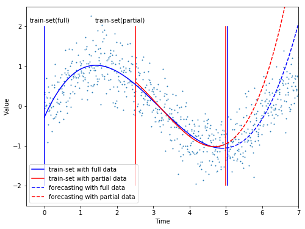

##  1. 설명변수(기간)에 어떻게 가중치를 부여하는 것이 효율적인가?

- 머신러닝의 강점은, 데이터 기반 통계/확룔 학습을 통해 추출한 최적의 가중치를 모델링에 사용하는 것
- 성능을 위해 임의로 데이터를 조작할(가중치를 부여할) 필요가 없음
- 다만, **데이터의 특성을 잘 반영할 수 있는 기법을 선택/튜닝하여** 보다 높은 성능을 이끌어 낼 수 있는 모델과 가중치를 찾아낼 수 있음

> 배경
>
> 본인의 과거 프로젝트(화장품 수요예측)  중 3년치 "날짜" 변수에 어떤 방식으로 가중치를 부여하여 활용하였는지 질의받았고, 다음 두가지 관점에서 고민해 볼 수 있음
>
> 1. **어떠한 가중치로 학습데이터를 (기간) 선별하는 것이 효과적인지 - 관점 A**
>
> 2. 혹은, **변수 자체에 가중치를 더하여 성능을 개선하는 방안 - 관점 B**
>
>    

### 관점 A- 어떠한 가중치로 학습데이터를 선별할 것인지 #샘플링 #편향

- 특정 기간의 데이터만 샘플링 하는 것은 모델링 환경에서 보다 높은 성능을 나타낼 수 있지만, 실제 수요 예측을 하는 경우 편향된 결과치를 예측할 수가 있음 (불안정적)

- SKU 마다 각자 수요의 특성은 다르겠지만, 1년 주기로 계절성을 (유사한 형태를) 띄는 경우가 통상적

- 이같은 경우 모델링 성능을 위해 1년 미만의 데이터를 샘플링하여 수요 예측에 사용하는 경우, SKU의 수요 특성을 백분 반영할 수 없음 (마치 다섯 장님이 각자 코끼리를 만지고 설명하는 것과 비슷한 케이스)

- 예시를 위해 삼각함수로 생성한 아래의 데이터로 간단한 테스트 시행

  

- 위의 그래프는 $f(x) = ax+bx^2+cx^3$ 형태의 간단한 모델에서 샘플링에 따른 성능 테스트를 나타냄:

  빨간 선은 임의로 샘플링하여 데이터의 대표성을 나타낸다고 보기 어렵고, 파란 선은 그나마 데이터의 특성을 상당히 반영할 수 있을 만큼 샘플링하여 모델 적합

- 학습데이터와 이웃한 데이터에서는 두 모델 간 예측의 편차가 크게 발생하지 않으나, 빨간색 모델은 멀어질수록 편차가 크게 발생

그럼에도 불구하고, 미지의 데이터를 가지고 수요를 예측할 때 파란색처럼 가용 데이터를 최대한 학습데이터로 활용하는 것이 무조건적으로 더 나은 성능을 보장한다고 보기는 어려움. 과적합의 문제도 있지만 실제로 빨간색의 학습데이터가 변화하는 미래 수요나 트렌드에 더 적합할 가능성도 배제할 수 없음. "샘플링을 제대로 하지도 못하며서 그냥 데이터만 막 들이밀면 문제가 잘 해결될 것 처럼 말하지 말라!" 라는 말을 종종 들을 수도 있지만, 미래 수요 예측을 하는데 있어 샘플링을 통한 **직관의 개입을 허용하기 보다는**, 가용한 데이터는 백분활용하되 객관적인 통계/확률 기법으로 추출한 **객관적 가중치를 바탕으로 예측**을 하는 것이 시스템 측면에서 안정적인 결과값으로 이어지지 않을까 생각함

추가로 Bootstrap 시뮬레이션 방식을 통해 

### 관점 B - 어떠한 방식으로 변수 자체에 가중치를 더하여 성능 개선이 가능한지

- 위에서 언급한 바와 같이 머신러닝의 강점은 통계/확률 학습을 통해 최적의 가중치를 찾는 데 있음

- 사람이 직접 변수에 가중치를 부여하는 것은 주관적 판단을 모델링에 개입시키는 것으로, 가중치를 부여할만한 명백한 근거가 바탕되지 않는다면 임의로 데이터를 조정하는 것은 바람직하지 않음

- 다만 모델링에 앞서 두가지 방식으로 성능 개선을 모색해 볼 수 있을 것:

  1) 변수 생성/변형

  - 예측하고자 하는 현상을 설명할 수 있는 다른 변수(feature)를 생성하거나 조합하여 설명력을 높일 수 있음. 단, 새로운 변수가 기존 변수와 높은 상관성을 나타내거나 예측 현상과 개연성이 떨어지는 노이즈에 지나치지 않는다면  오히려 역효과가 날 수 있음
  - 혹은 데이터 특성이나 분석 목적에 적합한 모델을 학습하기 위하여 데이터를 구조적으로 변경할 필요가 있음 (예를 들어 연속형 데이터를 범주형 데이터나 가변수로 변형)
  - 후자의 경우 결과적으로 변수 생성/변형에 따른 성능개선이라기 보다는 모델 변경에 따른 성능개선으로 볼 수 있음

  2) 학습 과정에 가중치(파라미터 조정) 부여

  - 최적의 가중치를 찾는 학습 과정은 기울기, 시뮬레이션 등 다양한 방식을 통해 모델의 성능을 개선시킴
  - 예를 들어 선형 회귀 모델에서 정규화를 (계수 크기 제한) 통해 성능을 향상시키는 Ridge/Lasso/Elastic 모델은, 패널티를 부여하는 가중치를 $\alpha$를 사용자가 직접 설정하며 모델링을 개선

___

## 2. 비선형 모델이 우수한 성능을 보이는 이유는 무엇인가?

https://dohk.tistory.com/170

___

## 3. SKU 별로 각기 다른 모델을 사용하는 것이 정말 효율적인가?

